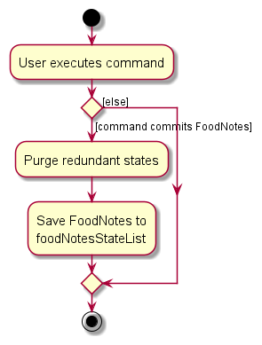

:information_source: Note: If the currentStatePointer is at index 0, pointing to the initial AddressBook state, then there are no previous AddressBook states to restore. The undo command uses Model#canUndoAddressBook() to check if this is the case. If so, it will return an error to the user rather
than attempting to perform the undo.

The following sequence diagram shows how the undo operation works:

:information_source: Note: The lifeline for UndoCommand should end at the destroy marker (X) but due to a limitation of PlantUML, the lifeline reaches the end of diagram.

The redo command does the opposite — it calls Model#redoAddressBook(), which shifts the currentStatePointer once to the right, pointing to the previously undone state, and restores the address book to that state.

:information_source: Note: If the currentStatePointer is at index addressBookStateList.size() - 1, pointing to the latest address book state, then there are no undone AddressBook states to restore. The redo command uses Model#canRedoAddressBook() to check if this is the case. If so, it will return an error to the user rather than attempting to perform the redo.

Step 5. The user then decides to execute the command list. Commands that do not modify the address book, such as list, will usually not call Model#commitAddressBook(), Model#undoAddressBook() or Model#redoAddressBook(). Thus, the addressBookStateList remains unchanged.

Step 6. The user executes clear, which calls Model#commitAddressBook(). Since the currentStatePointer is not pointing at the end of the addressBookStateList, all address book states after the currentStatePointer will be purged. Reason: It no longer makes sense to redo the add n/David …​ command. This is the behavior that most modern desktop applications follow.

The following activity diagram summarizes what happens when a user executes a new command:

#### Design considerations:

Aspect: How undo & redo executes:

* Alternative 1 (current choice): Saves the entire address book.
    * Pros: Easy to implement.
    * Cons: May have performance issues in terms of memory usage.

* Alternative 2: Individual command knows how to undo/redo by
  itself.
    * Pros: Will use less memory (e.g. for delete, just save the person being deleted).
    * Cons: We must ensure that the implementation of each individual command are correct.

_{more aspects and alternatives to be added}_

### \[Proposed\] Data archiving

_{Explain here how the data archiving feature will be implemented}_

--------------------------------------------------------------------------------------------------------------------

## Documentation, logging, testing, configuration, dev-ops

* [Documentation guide](Documentation.md)
* [Testing guide](Testing.md)
* [Logging guide](Logging.md)
* [Configuration guide](Configuration.md)
* [DevOps guide](DevOps.md)

--------------------------------------------------------------------------------------------------------------------

## Appendix: Requirements

### Product scope

Target user profile:

* has a need to manage a significant number of contacts
* prefer desktop apps over other types
* can type fast
* prefers typing to mouse interactions
* is reasonably comfortable using CLI apps

Value proposition: manage contacts faster than a typical mouse/GUI driven app

### User stories

Priorities: High (must have) - * * *, Medium (nice to have) - * *, Low (unlikely to have) - *
| Priority | As a …​                                    | I want to …​                     | So that I can…​                                                        |
| -------- | ------------------------------------------ | ------------------------------ | ---------------------------------------------------------------------- |
| * * *  | new user                                   | see usage instructions         | refer to instructions when I forget how to use the App                 |
| * * *  | user                                       | add a new person               |                                                                        |
| * * *  | user                                       | delete a person                | remove entries that I no longer need                                   |
| * * *  | user                                       | find a person by name          | locate details of persons without having to go through the entire list |
| * *    | user                                       | hide private contact details   | minimize chance of someone else seeing them by accident                |
| *      | user with many persons in the address book | sort persons by name           | locate a person easily                                                 |

*{More to be added}*

### Use cases

(For all use cases below, the System is the FoodNote and the Actor is the user, unless specified otherwise)

Use case: Add a stall

MSS

1.  User requests to add a stall
2.  User key in stall details with stall name and location
3.  Stall added to the list

    Use case ends.

Extensions

* 2a. The stall name or location is not specified
    * FoodNote shows an error message.

      Use case ends.

Use case: Add a review for stalls

MSS

1.  User requests to add a review for a stall
2.  User key in star ratings and description for the stall
3.  Review added for the stall

    Use case ends.

Extensions

* 2a. The star ratings and description for the stall not specified
    * FoodNote shows an error message.

      Use case ends.

Use case: Add a menu item for a stall

MSS

1.  User requests to add a menu item
2.  User key in stall number and item name
3.  Menu item added to the stall

    Use case ends.

Extensions

* 2a. User key in invalid stall number
    * FoodNote displays error message

  Use case ends.

Use case: Delete food item

MSS

1.  User requests to delete a food item from a stall
2.  User key in stall number and item number
3.  Menu item deleted

    Use case ends.

Extensions

* 2a. User key in invalid stall number or item number
    * FoodNote displays error message

  Use case ends.

*{More to be added}*

### Non-Functional Requirements

1.  Should work on any _mainstream OS_ as long as it has Java 11 or above installed.
2.  Should be able to hold up to 1000 persons without a noticeable sluggishness in performance for typical usage.
3.  A user with above average typing speed for regular English text (i.e. not code, not system admin commands) should be able to accomplish most of the tasks faster using commands than using the mouse.

*{More to be added}*

### Glossary

* Mainstream OS: Windows, Linux, Unix, OS-X
* Private contact detail: A contact detail that is not meant to be shared with others

--------------------------------------------------------------------------------------------------------------------

## Appendix: Instructions for manual testing

Given below are instructions to test the app manually.

:information_source: Note: These instructions only provide a starting point for testers to work on;
testers are expected to do more *exploratory* testing.

### Launch and shutdown

1. Initial launch

    1. Download the jar file and copy into an empty folder

    1. Double-click the jar file Expected: Shows the GUI with a set of sample contacts. The window size may not be optimum.

1. Saving window preferences
1. Resize the window to an optimum size. Move the window to a different location. Close the window.

    1. Re-launch the app by double-clicking the jar file. 
       Expected: The most recent window size and location is retained.

1. _{ more test cases …​ }_

### Deleting a person

1. Deleting a person while all persons are being shown

    1. Prerequisites: List all persons using the list command. Multiple persons in the list.

    1. Test case: `delete 1` 
       Expected: First contact is deleted from the list. Details of the deleted contact shown in the status message. Timestamp in the status bar is updated.

    1. Test case: `delete 0` 
       Expected: No person is deleted. Error details shown in the status message. Status bar remains the same.

    1. Other incorrect delete commands to try: delete, delete x, ... (where x is larger than the list size) 
       Expected: Similar to previous.

1. _{ more test cases …​ }_

### Saving data

1. Dealing with missing/corrupted data files

    1. _{explain how to simulate a missing/corrupted file, and the expected behavior}_

1. _{ more test cases …​ }_